Getting Started with Productboard

**Access Link:** https://securonixinc.productboard.com/insights/notes/all-notes

Productboard is a dedicated product management system that helps you align everyone on the right features to build next.

Currently, we have multiple communication channels for customer feedback, requests as well as internal communication so some data might be lost and it might not get prioritized properly.

Productboard helps with this aspect by consolidating all data in one place and also helps using that insights to prioritise and build new features.

- **Understanding what users really need**
  - **Prioritizing what to build based on clear objectives**
    - **Rallying everyone around the roadmap**

**Platform Overview:**

**Insights**

Consolidate ideas, requests, and feedback to understand what users really need. **Features**

Organize feature ideas, prioritize around clear objectives, and plan upcoming releases. **Roadmap**

Share your roadmap to align your team and rally everyone around where your product is headed and why. **Portal**

Engage your user community: validate ideas by collecting upvotes and feedback, share your plans, and showcase recent launches.

**Data Imports (Insights):**

We can import necessary user data manually or by integrations into the insights section. They are created as notes in Productboard which can then be added to necessary issues/bugs/features in feature section.

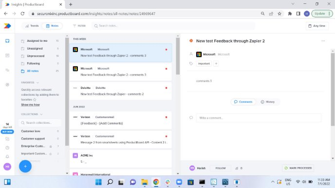

Each note has the following fields:

- Note Title
  - Note content + attachments
    - User/Company
      - Tags

Notes can be added to Productboard through any of the following methods:

1. **Slack**

Any slack message can be added to Productboard (Once you have been given access to Platform) by selecting the three dots on right corner next to the message and selecting push to Productboard.

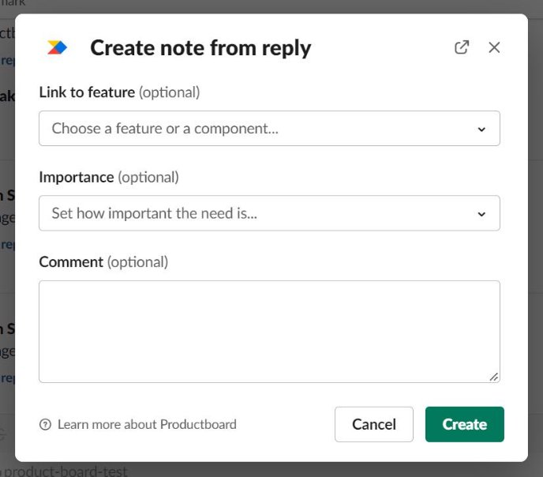

2. **Email**

We can forward any communication from email to Productboard default email ( which we can customise ) and have it added to our Platform automatically.

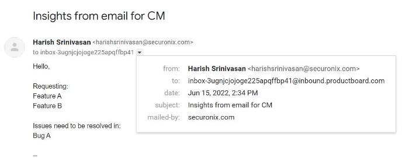

3. **Chrome extension**

By downloading the Productboard, we can select a text from any website and click on Productboard extension icon and add it to Productboard.

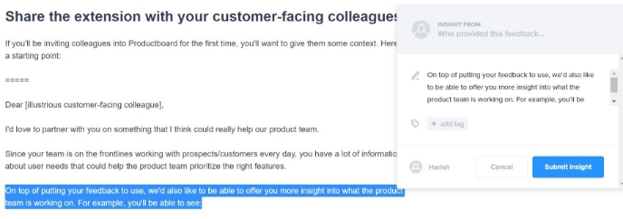

4. **Zapier**

We can import data from Smartsheets, Totango on a continuous basis to Productboard with the help of their open API and Zapier to facilitate an integration.

**4.1 Sample Zapier Integration:**

1. Open Zapier
1. Click on create new Zap
1. Choose required app ( for eg: Smartsheet ) to connect to Productboard
1. Select event to create note in Productboard and authorise your account
1. Set up a trigger which can be any action like new row added, row value updated (or anything similar to your app)
1. Next, select Productboard as the other app and authorise your account
1. Choose relevant fields to be mapped from your app choice to Productboard
1. Test your connection
1. Now anytime you add new information to your app, it gets added to Productboard automatically

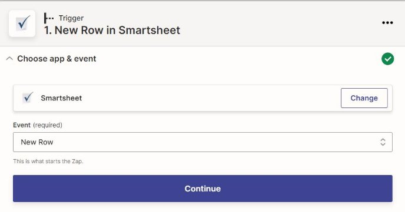

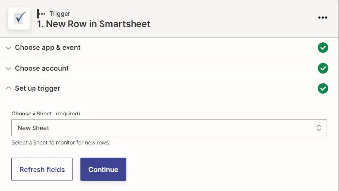

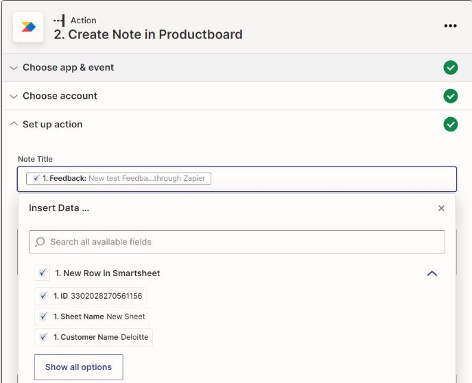

These Zapier integrations can be used for other data platforms where we have a continuous influx of data and need it to be updated to Productboard as well.

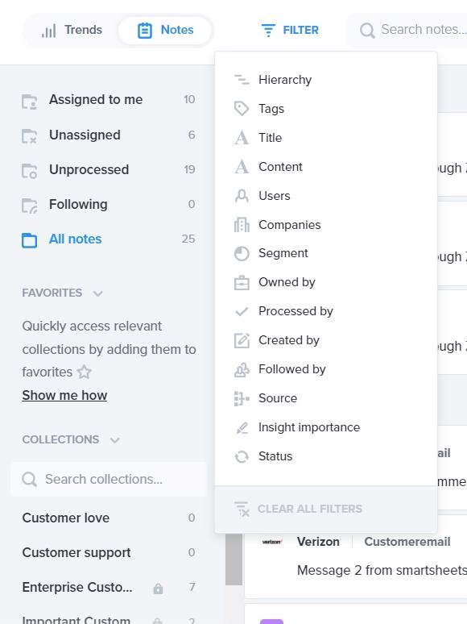

Additionally, we can sort our input data as notes by using any of these filters and add them to collections for easier accessibility.

Features section:

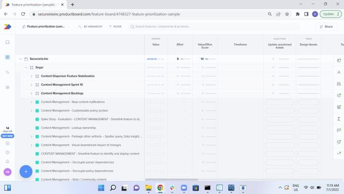

The features section contains all of our projects ( currently: Content Management and Data Team only) and the relevant issues in them. You can link customer feedback/insight/request or any other data from Insights section to here. This is the place where we can prioritize issues and get a view of everything we have in plan for current and upcoming sprint.

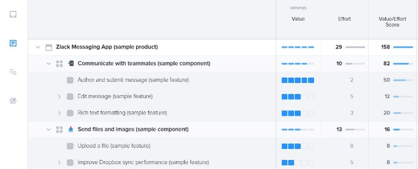

For each feature idea in this section, we can assign priority as value and effort ( story points ) which would give us a Value effort score. We can also add a user impact score to this which reflects how many times a user has requested for a particular feature.

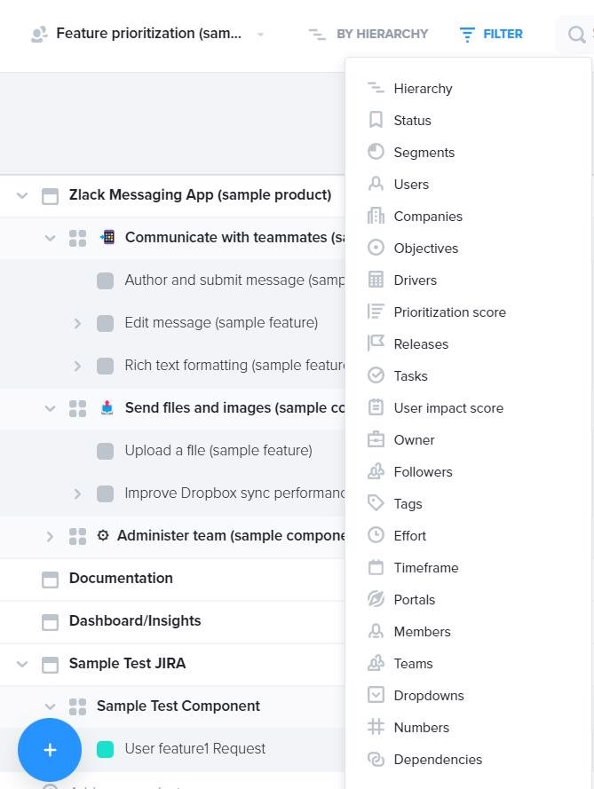

Furthermore, we get similar filters like insights which enable us to sort these features based on any of the filter values:

- We can sort features by team, sprints or status
  - We can identify certain company/customer segments and track the completion status of those features alone

Roadmap:

Roadmaps are used to identify direction, priorities, and progress of a product over time. They help to align the organization around short- and long-term goals for the product or project, and how they will be achieved.

Good Roadmaps are:

1. Up to date guide on helping achieve product vision
1. Useful in showcasing product impact
1. Helpful in facilitating collaboration and gives a clear sense of direction to the team
1. A great tool to reflect customer feedback and support their concerns.

Productboard can help with all of the above by providing an adaptable and easily modifiable roadmap.

In this section, we can get different views of our issues and feature stories and we can sort them however we want based on who we are presenting our Roadmap to. This section feature many filters which we can use to sort issues based on our preferences.

We can choose any particular roadmap of our preference depending on the audience and view our feature releases with timelines accordingly. The sprint backlog roadmap can be used to see what issues have been prioritized for what particular sprints and the feature timeline roadmap helps to see the high level feature releases.

**Sharing roadmaps:**

We can export our roadmaps as pdf, png to be added to any presentation or we can make use of the copy link feature available under the share option to share a link through any communication channels. A more detailed walkthrough can be found in this recording:

https://securonix.zoom.us/rec/share/Ue7MQ4aKY5lFluE4TSKbJmj-CSjEYXJ9Rz0SuiMC04R\_bLoV54TLjNPBFjDfd98c.fUFNUrvbdqikK64E Passcode: s!2FPt=c

The above is a representation of our Roadmap which has been embedded to this confluence page. **Portal:**

Portal is a flexible, interactive interface you can share with colleagues and/or customers to validate ideas and keep everyone informed. It can be used to used to collect feedback on ideas under consideration. All new ideas and feedback submitted on the Portal are routed back to the Insights board so they can be analysed alongside other inputs.

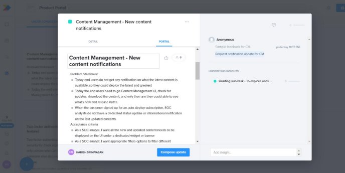

**To add an idea:**

1. Click the plus icon at the bottom
1. Select feature idea to be displayed for internal/customer view.
1. Add to portal

Then we can see the portal idea and the corresponding insights added for it. **Action items for Productboard setup:**

|**Action Item**|**Timeline**|Status|
| - | - | - |
|Get clarification on JIRA to PB field mapping and implement it for CM and Data Teams|Wed(6/22) - Fri (6/24)|Meeting on July 7th|
|Import all current smartsheet information. |Wed(6/22)|Done|
|Develop API to continuously pull data from Smartsheet to PB|Wed(6/22) - Fri (6/24)|Done|
|Get overview of information in Totango and develop API to automatically update data to PB|Wed(6/22) - Mon (6/27)|In progress|
|Structure customer feedback, issues, backlog and roadmaps in PB.|Wed(6/22) - Mon(6/27)|In progress|
|Provide demo sessions to PMs and get their feedback and requirements and assist with prioritization|Mon(6/27) - Wed (6/29)|In progress|
|Go live for the CM and Data Team and monitor and make any necessary adjustments if required for test run. |Mon(6/27) - Wed (6/29)|In progress|
|Test Run|Wed (6/29) - Wed (7/8)|In progress|
**External references: [Getting started](https://support.productboard.com/hc/en-us/articles/360056293874-2-Getting-Started)**
