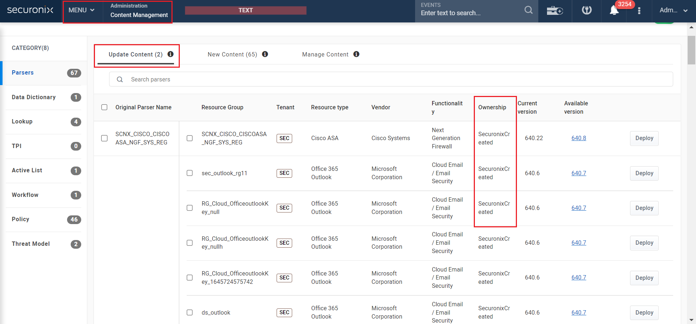
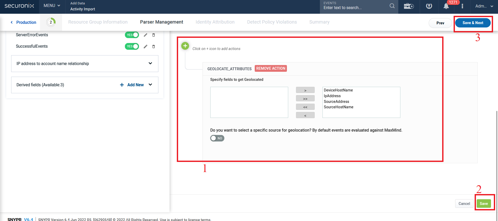
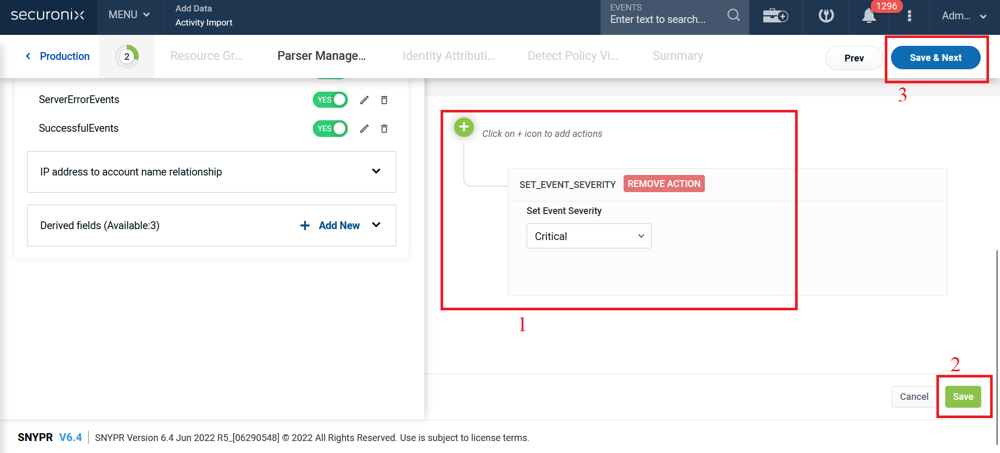
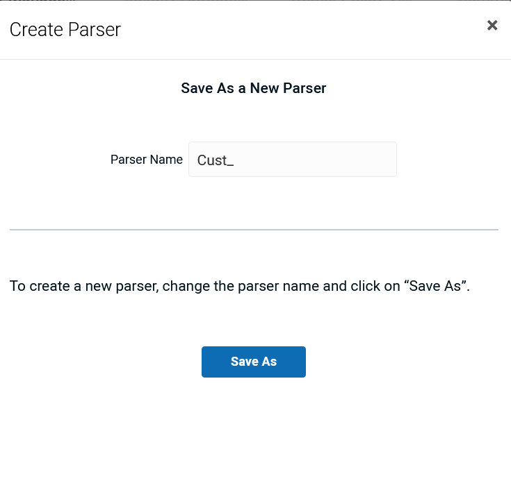
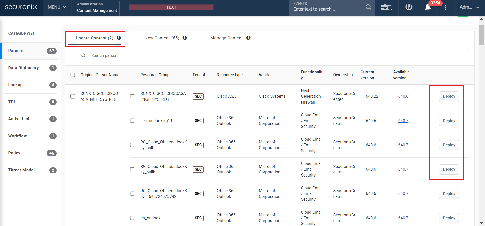
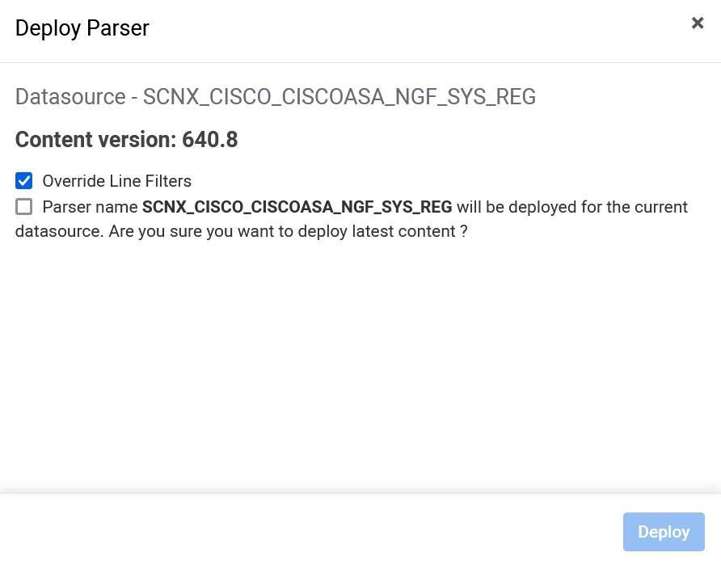
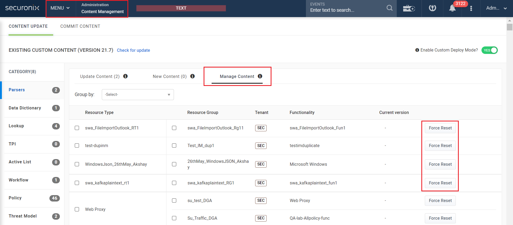
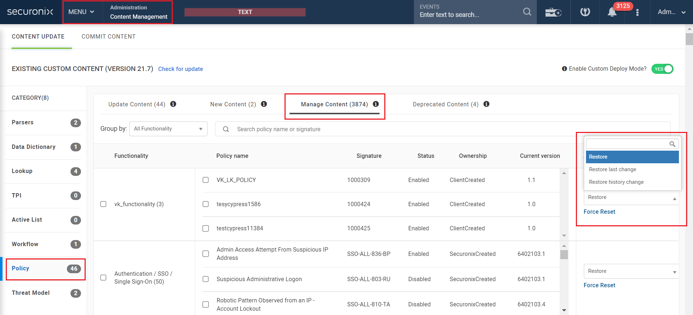
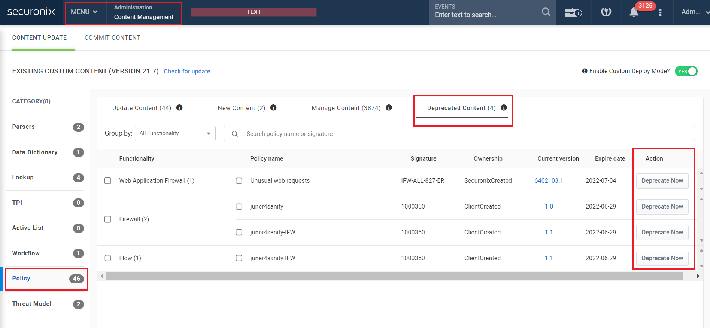

# New Features

## Table of Contents
1. [Problem Statement](#1-problem-statement)
2. [Objective](#2-objective)
3. [Prerequisites](#3-prerequistes)
4. [Steps](#4-steps)
    1. [From Content Development Perspective](#41-from-content-development-perspective)
        1. [Parsers](#411-parsers)
            1. [Ownership Tracking](#4111-ownership-tracking)
            2. [Allowed Changes](#4112-allowed-changes)
            3. [Restricted Changes](#4113-restricted-changes)
    2. [From Content Admin Perspective](#42-from-content-admin-perspective)
        1. [Parsers](#421-parsers)
            1. [New Improved Deploy Action](#4211-new-improved-deploy-action)
            2. [Manage Content](#4212-manage-content)
            3. [Daily Housekeeping Job](#4213-daily-housekeeping-job)
        2. [Policies](#422-policies)
            1. [Manage Content](#4221-manage-content)
            2. [Deprecate Policies](#4222-deprecate-policies)

-----

### 1 Problem Statement
Customers don’t have an option to update customized securonix OOTB parsers. Application lacks ownership tracking of the parser at a granular level.

### 2 Objective
Resource groups require a certain level of customization specific to a customer or tenant. Eg: Geolocation Enrichment, IP Attribution, TPI enrichment,etc. Improved parser data flow and content management deploy logic allows the users to retain the Customer created content and receive updates to Securonix created content. 

### 3 Prerequistes
* SYNPR 6.4 access
* Role - ROLE_CONTENT_ADMIN or ROLE_CONTENT_DEVELOPER
* Any updates to Parsers or Policies

### 4 Steps

#### 4.1 From Content Development Perspective

##### 4.1.1 Parsers

###### 4.1.1.1 Ownership Tracking
Ownership changes to ClientCreated (from SecuronixCreated) when Major Changes are made. This employs granular tracking which was not available previously. Line Filters and Action Filters can be updated but Derived Fields and Categorization Enrichments are not tracked in this ownership change. Categorization Enrichments are restricted (covered under Restricted Changes below). However, this ownership tracking currently only applies to Securonix owned Parsers (i.e. starting with SCNX_ or having CRPid as less than 1 Million).

<<<<<<< Updated upstream
<!--  -->

=======
<!--  -->

>>>>>>> Stashed changes

###### 4.1.1.2 Allowed Changes
Changes to Geolocation, TPI, Lookups, Activelists and IP Attribution are all allowed to Clients and do not require the creation of a CUST_ parser.

<<<<<<< Updated upstream

Fill in the relevant details then click Save & Next on the top right of the screen:

On the next screen (Parser Management), Click on Conditional Actions and then Add Condition:

Fill in the details as required and in the “Select Actions for Above Conditions” section, choose “Geolocate Attributes” or something else except the first 2 (Set Event Severity, Set Event Category) since those are restricted changes. Fill in the data as required and click on Save at the bottom of the screen. Finally, click on Save & Next at the top right of the screen:

You will see that a pop up screen will appear that says you can either Save the changes to overwrite the existing parser (since this is an Allowed Change) or choose Save As to make a new copy of the Parser:

=======

Fill in the relevant details then click Save & Next on the top right of the screen:

On the next screen (Parser Management), Click on Conditional Actions and then Add Condition:

Fill in the details as required and in the “Select Actions for Above Conditions” section, choose “Geolocate Attributes” or something else except the first 2 (Set Event Severity, Set Event Category) since those are restricted changes. Fill in the data as required and click on Save at the bottom of the screen. Finally, click on Save & Next at the top right of the screen:

You will see that a pop up screen will appear that says you can either Save the changes to overwrite the existing parser (since this is an Allowed Change) or choose Save As to make a new copy of the Parser:

>>>>>>> Stashed changes

###### 4.1.1.3 Restricted Changes
Categorization Enrichments are not allowed. For example, Set Event Severity and Set Event Category are not allowed to be changed by Clients. If a Client wants to modify these, they will be forced to create a CUST_ parser.

<<<<<<< Updated upstream

Fill in the relevant details then click Save & Next on the top right of the screen:

On the next screen (Parser Management), Click on Conditional Actions and then Add Condition:

Fill in the details as required and in the “Select Actions for Above Conditions” section, choose either “Set Event Severity” or “Set Event Category” since these 2 are restricted changes. Fill in the data as required and click on Save at the bottom of the screen. Finally, click on Save & Next at the top right of the screen:

You will see that a pop up screen will appear that says you need to Save the settings as a New Parser:

=======

Fill in the relevant details then click Save & Next on the top right of the screen:

On the next screen (Parser Management), Click on Conditional Actions and then Add Condition:

Fill in the details as required and in the “Select Actions for Above Conditions” section, choose either “Set Event Severity” or “Set Event Category” since these 2 are restricted changes. Fill in the data as required and click on Save at the bottom of the screen. Finally, click on Save & Next at the top right of the screen:

You will see that a pop up screen will appear that says you need to Save the settings as a New Parser:

>>>>>>> Stashed changes

This is because this is a restricted change and will create a CUST_ parser instead of affecting the SCNX_ parser.

#### 4.2 From Content Admin Perspective

##### 4.2.1 Parsers

###### 4.2.1.1 New Improved Deploy Action
Till now the Deploy Parser action to update Parser used to overwrite any Line Filter Customizations that the client had made. The new improved deploy action allows clients to keep their own Line Filters customizations on Parsers and still get them updated to the newest versions when they are available. This is done by showing a popup when clicking the Deploy button which gives the client the choice to overwrite the Line Filters or not.

<<<<<<< Updated upstream

=======

>>>>>>> Stashed changes

Here, ticking the first option will overwrite the line filters that the customer might have modified (essentially replacing the parser with the latest OOTB parser) while unticking it will ensure that the parser is updated to the latest version while keeping the line filter customizations that the customer did as-is. The second option is basically a confirmation checkbox and the deploy button becomes clickable only when this is ticked.

###### 4.2.1.2 Manage Content
The Manage Content screen allows a Parser to be force deployed and resetted back to the Securonix OOTB Parser by reading the latest data from the Data folder and overwriting the customized data. This means any customization that the Client has done (and which may or may not have resulted in any corruption be it intentional or otherwise) will be wiped out and replaced with the OOTB Parser.

<<<<<<< Updated upstream

=======

>>>>>>> Stashed changes

###### 4.2.1.3 Daily Housekeeping Job
A dedicated job that runs every 24 hours. This job will check if there are any new parsers in the CRP folders and automatically deploys them in the CRP table. This job also runs when a new datasource is added for the first time.

<<<<<<< Updated upstream

=======

>>>>>>> Stashed changes

##### 4.2.2 Policies

###### 4.2.2.1 Manage Content
The Manage Content screen allows a Policy to be force deployed and resetted back to the Securonix OOTB Policy by reading the latest data from the Data folder and overwriting the customized data. This means any customization that the Client has done (and which may or may not have resulted in any corruption be it intentional or otherwise) will be wiped out and replaced with the OOTB Policy.

<<<<<<< Updated upstream

=======

>>>>>>> Stashed changes

###### 4.2.2.2 Deprecate Policies
There are 2 ways to deprecate a policy:

1. Developers can simply remove the config files corresponding to that policy from the SVN repository. This will automatically start the counter (in a range of 60-90 days). This is to ensure that clients have sufficient time to either clone the policy or create a duplicate version of the policy if they need it or they can modify and retain the policy.

2. We can set the configuration of the policy from the UI and set a user defined counter which can be any number of days (even less than 60 days if needed). This can be useful in case there is a vendor deprecation or functionality deprecation in play.

<<<<<<< Updated upstream

=======

>>>>>>> Stashed changes

Two scenarios can arise here:

1. If there is a violation, preserve the violation, disable the policy and under “Policy Violation” show that policy is deprecated. Additionally, the user is not allowed to re-enable them.

2. If there is no violation, remove it under “Policy Violation”.